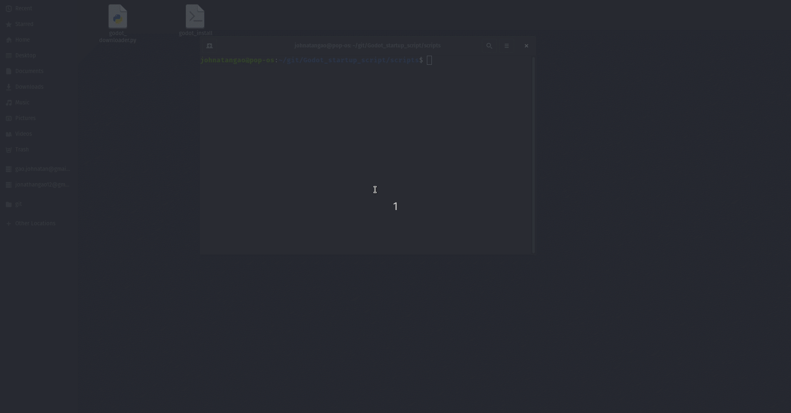

# Godot_startup_script
## A Bash script to startup Godot


This is a fun little project as an Introduction to Web Scraping, Python and Shell Scripts! (Since it was my first time doing such a thing it took me way too much time :D)

The goal of the script was to automate the installation of Godot, since godot is self-contained and doesn't offer an installer, I figured that it would be cool to offer a way to download and "install" the latest version of godot!

This script will also facilitate the creation of a .desktop launcher in GNOME and other freedesktop.org-compliant desktops since this script should work even if we update Godot to a newer version

## Godot Install Script

```Bash

#Options in the godot script

os=linux # linux for linux | windows for windows | osx for macos
version=64 # 32 or 64 bit
mono_version=true #mono version or not (true or false)
downloaded_filename=Godot_vXX.zip
godot_installed_path=$HOME/godot/app/

```

## Steps for making the scripts work:

0. Download the repo somewhere in your system
```Bash
    git clone https://github.com/johnatangao/Godot_startup_script
```
1. Modify the different settings in order to suit your needs

2. Make the different scripts executable by typing
```Bash
    chmod +x godot
    chmod +x godot_downloader.py
```
3. Make sure that python3 is installed on your system [Install Python Guide](https://realpython.com/installing-python/)

    **Upon further testing make sure that python3 is the "default" python by typing...**
    ```Bash
        sudo update-alternatives --install /usr/bin/python python /usr/bin/python3 10
    ```

4. Make sure that that beautiful soup is installed (library used for web scraping) [Install Beautiful Soup Guide](https://www.pythonforbeginners.com/beautifulsoup/beautifulsoup-4-python)
5. Make sure that tqdm is installed (for that sweet download progress bar) [Install tqdm](https://pypi.org/project/tqdm/)
6. Add the scripts folder to your PATH (special thanks to u/Sinaazk, u/TimishTV, Charles Duffy and Usman Khan for helping me out) [Link](https://gist.github.com/nex3/c395b2f8fd4b02068be37c961301caa7)
```Bash
    #open the nano text editor to modify the file
    nano ~/.bashrc

    #Add this line at the end of the bashrc (for linux user) for other OSes please consult the link I provided file and restart the terminal
    export PATH="$PATH:PATH/TO/THE/SCRIPTS/FOLDER"

```
7. Execute the scripts and Have fun!
```Bash
#TO INSTALL LATEST STABLE VERSION OF GODOT 
godot install

#TO LAUNCH GODOT 
godot
```


Unfortunately, I did some research, and I couldn't really find a way to create a shortcut to launch a Bash script on Windows :( [People with high iq pls tell me xD]

## Apparently there's a way to create Mac apps from shell script!
Link: https://mathiasbynens.be/notes/shell-script-mac-apps 

## Steps to create .desktop file in order to add godot to our launcher (in GNOME)

(Way #1):
- Download a menu editor to add the launcher (Which is what I did)

(Way #2):
- Create a .desktop file manually (go see https://developer.gnome.org/integration-guide/stable/desktop-files.html.en)

